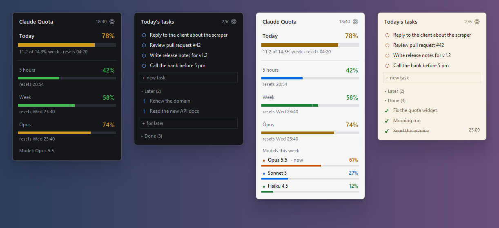

# Claude Quota & Daily Tasks — desktop widgets for Windows

Two small desktop widgets written in plain Python (standard library only, no `pip install`):

- **Claude Quota** (`quota_widget.py`) shows your Claude Code subscription limits:
  the 5‑hour window, the weekly limit, per‑model weekly limits and a **daily budget**
  (1/7 of the week, 14.3% a day). It can also show the model Claude Code answered with last.
- **Daily Tasks** (`tasks_widget.py`) is a to‑do list for today. Ticked tasks disappear from the list
  but stay under "Done". A separate "Later" list holds tasks you haven't scheduled yet.

Both widgets sit on the desktop under your windows by default (or stay always on top),
have rounded corners, six color themes and five languages:
English, Українська, Polski, Deutsch, Español.

## Requirements

- Windows 10 or 11
- [Python 3.8+](https://www.python.org/downloads/windows/) installed with the default options (they include tkinter)
- For the quota widget: [Claude Code](https://docs.claude.com/en/docs/claude-code/overview), signed in
  **once in the terminal** with a Claude subscription (`claude`, then `/login`, then
  "Claude account with subscription"). The widget reads the token that Claude Code stores in
  `%USERPROFILE%\.claude\.credentials.json`.

The tasks widget has no requirements beyond Python.

### Using your own token

By default the quota widget uses the account you signed in with in the `claude` terminal. To use a
different token, pick one of these options. The first one that is set wins:

1. **Menu → Own token…**. Paste the token, and it is saved to `token.txt` next to the script
   (this file is in `.gitignore` and never leaves your PC). Clear the field to go back to the `claude` login.
2. Set the environment variable **`CLAUDE_QUOTA_TOKEN`** (only this widget reads it) or
   **`CLAUDE_CODE_OAUTH_TOKEN`** (Claude Code itself reads it too).
3. If Claude Code keeps its data somewhere other than `%USERPROFILE%\.claude`, set
   **`CLAUDE_CONFIG_DIR`**, the same variable Claude Code uses. The widget reads
   `.credentials.json` and the session logs from there.

Which tokens work:

- **Subscription OAuth token (Pro / Max / Team)** works. You can get a long‑lived one with
  `claude setup-token`. It starts with `sk-ant-oat…`.
- **Console API key (`sk-ant-api…`)** has no subscription limits to show, because API usage is
  billed per token. The widget tells you this ("API key has no quota") and makes no request.

A pasted token isn't refreshed automatically, because there's no refresh token to refresh it with.
When it expires, paste a new one. If the server rejects a `setup-token` token ("token rejected"),
it may lack the scope this endpoint needs. In that case sign in with `claude` / `/login`.

## Install

1. Download the repository (**Code → Download ZIP**) and unpack it anywhere, or `git clone` it.
2. Double‑click **`start.bat`** to start both widgets.
   You can also start just one of them: `pythonw quota_widget.py` or `pythonw tasks_widget.py`.
3. To start a widget with Windows, open its menu (⚙ or right click) and turn on **Start with Windows**.

Drag a widget with the left mouse button. Settings and tasks are saved next to the scripts.

## Quota widget

| Row | Meaning |
|---|---|
| Today | how much of today's budget (1/7 of the week) you've used. A day starts at your weekly reset time, not at midnight |
| 5 hours | the rolling 5‑hour session limit |
| Week | the weekly limit. The thin tick marks where you'd be if you used the week evenly |
| model rows | per‑model weekly limits, when your plan has them |
| Model: … | the model of the most recent Claude Code reply, read from the local session logs (see below) |

Colors (in the ⚙ menu):

- **Bar colors → By usage level**: green, then amber, then red as a limit fills up.
- **Bar colors → Own color per limit**: each row has its own color while usage is normal, and
  switches to amber or red when it gets high.
- **Color the percentages**: the numbers follow the same green, amber and red levels.
- **Color thresholds**: 60/85%, 70/90% (default) or 80/95%.
- **Theme**: Light, Dark, Ocean, Violet, Forest or Sand.

**Models at the bottom** (⚙ menu). The default is the simple line:

- **Current only**: one line, `Model: Opus 5.5`. This is the default.
- **All this week (colors and shares)**: every model you used during the current quota week. Each
  model has its own color: Opus, Sonnet, Haiku and Fable each have one, and a second version of the
  same family gets a paler shade. Each bar is filled by that model's share of the week, and the model
  in use right now is marked **now**. Shares come from the local Claude Code logs, subagents included.
  Tokens are weighted roughly by price (output ×5, cache write ×1.25, cache read ×0.1). These are
  relative shares between models, not a limit. The first count reads the week's logs once, which
  takes about 10 s per 2 GB, and after that only new lines are read.
- **Hide**.

In the "Own color per limit" mode, a per‑model limit row such as "Opus 74%" uses the same color as
that model in the list.

### How it works, and what to know

- Data comes from `GET https://api.anthropic.com/api/oauth/usage`. This is the endpoint Claude Code
  itself calls. It is **not a public, documented API** and may change or disappear.
- The widget polls at most once every 3 minutes (every 5 minutes by default). Polling more often gets HTTP 429.
- If the access token in `.credentials.json` has expired, the widget **refreshes it itself** and
  writes the new token back to the file, the same way the Claude Code CLI does. This matters if you
  mostly use the Claude desktop app, which doesn't update that file.
- When the refresh token itself expires (after about two weeks without logging in), the widget
  shows "run claude /login". Sign in again in the terminal.
- Nothing is sent anywhere except the two Anthropic endpoints above.

## Tasks widget

- Type in **+ new task** and press **Enter**. **Esc** clears the field.
- Click **○** to mark a task done. It moves to **Done**, where **✓** puts it back.
- **Later** is a separate list with its own input. **↑** moves a task to today.
- Right‑click a task for more actions (move, delete).
- Unfinished tasks simply stay on the list the next day. Done tasks are kept for 30 days.
- Tasks live in `tasks.json` next to the script. It is plain JSON, easy to back up or sync.

## Files

| File | Purpose |
|---|---|
| `common.py` | shared window behaviour, themes, translations |
| `quota_widget.py` | the quota widget |
| `tasks_widget.py` | the tasks widget |
| `start.bat` | starts both widgets without a console window |
| `settings.json`, `state.json`, `tasks.json`, `tasks_settings.json`, `token.txt`, `model_usage.json` | created at runtime, not in git |
| `docs/screenshot.png` | the picture above (demo data) |

## Adding a language

Copy one block in `STRINGS` in `common.py`, translate the values, and add the code to
`LANG_ORDER` and `LANG_NAMES`. Short status texts must stay under about 140 px in the header.

## License

MIT. See [LICENSE](LICENSE). This project is not affiliated with or endorsed by Anthropic.

---

## Українською

Два віджети для робочого столу Windows на чистому Python:

- **Квота Claude** показує 5‑годинний і тижневий ліміти підписки Claude Code, ліміти по
  моделях і **денну норму** (1/7 тижня). Внизу видно модель, якою Claude Code відповідав останнім.
- **Задачі на сьогодні**: виконана задача зникає зі списку, але лишається у «Виконаних».
  Є окремий список «На потім».

Встановлення: поставити Python 3.8+, завантажити архів, запустити `start.bat`.
Автозапуск вмикається в меню ⚙. Для віджета квоти треба один раз увійти в `claude` у терміналі
(`/login` → «Claude account with subscription») або вставити свій OAuth-токен підписки через
меню «Свій токен…» (або змінну `CLAUDE_QUOTA_TOKEN`). API-ключ Console не підійде: у нього
немає лімітів підписки.
